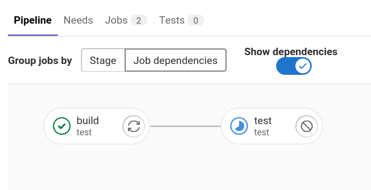
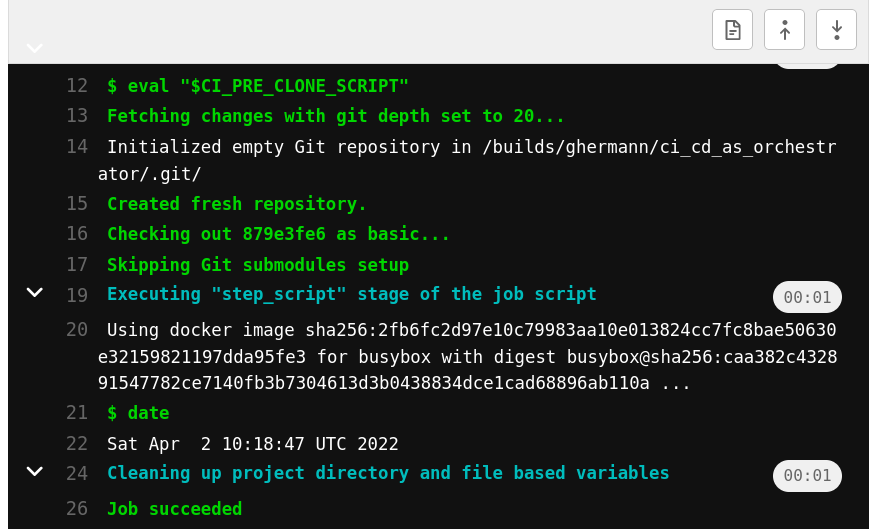

+++
title = "Don't use Airflow, use your CI/CD tool for orchestration"
date = 2022-01-09
+++

Nobody loves Airflow.
It's pretty cool, but there's so much pain.
So people come up with new tools like Perfect, Dagster, Flyte, Argo.
These new tools will have new pains. I think we can actually avoid the new pains.
We can use our good old CI/CD tooling like GitLab CI for orchestration.

No offense.
Huge thanks and respect to the folks that build Airflow and other orchestration tools.
I've been using Airflow in production for a few years and it saved me from flaky bash scripts running as cronjobs.
I just think we have a better alternative.

I'm going to schedule a data pipeline with GitLab CI to demonstrate how to use it for orchestration.
You can probably do the same with GitHub Actions, Jenkins, Travis, or similar (if not, call me out on it).

# All you need is GitLab CI

What do we need for "orchestration"?

- **DAG** (directed acyclic graph) of dependencies.
- **Schedule**/cron.
- **Web UI**
  - Overview of pipeline status.
  - Trigger pipeline.
  - DAG view.
  - Logs view.
- **Alerts** on failure.

I don't think we really need more and GitLab CI can do all of this.

# Example setup

We will
- **start with a CI/CD pipeline** that we already have,
- **define a data pipeline** in `.gitlab-ci.yml`,
- **run the data pipeline separately** from CI/CD pipeline,
- **schedule data pipeline** in GitLab web UI, and
- **use web UI** to trigger pipeline, view DAG, logs.

#### Start with a CI/CD pipeline

Let's say we already use GitLab CI and have a CI/CD pipeline defined in `.gitlab-ci.yml`.

```yaml
build:
  script:
    - echo "Let's do some building."

test:
  needs:
    - build
  script:
    - echo "Let's run all the unit tests."
```

GitLab will run this pipeline when we `git push`.
It will first run `build` then `test` because we defined that `test` `needs` `build`.



This pipeline is already a (very simple) DAG, but it's not the data pipeline that we want to schedule.

#### Define a data pipeline

Let's say we'd like to do something like the [Airflow tutorial](https://airflow.apache.org/docs/apache-airflow/stable/tutorial.html): add some commands, define dependencies between them.

```yaml
print_date:
  rules:
    - if: '$PIPELINE_NAME == "my_pipeline"'
  script:
    - date

sleep:
  rules:
    - if: '$PIPELINE_NAME == "my_pipeline"'
  needs:
    - print_date
  script:
    - sleep 5
  retry: 2

script:
  rules:
    - if: '$PIPELINE_NAME == "my_pipeline"'
  image: python:3-slim
  needs:
    - print_date
  script:
    - python my_script.py
```

We define three jobs (`print_date`, `sleep`, and `script`) and define what they should do (`script` keyword).
We define the dependencies between them with the `needs` keyword: both `sleep` and `script` depends on `print_date`.
We can even define if we want to `retry` and how many times (similarly to Airflow `retries`).
We already have a DAG.

A fun fact is that we don't even have to deploy in this setup.
The `script` Job can run a `python` Docker image and `my_script.py` is already fetched from Git, so we can safely execute `python my_script.py`.
In simple cases where we have a scripting language with no special dependencies, we can "deploy" can by merging to the main git branch.

#### Run the data pipeline separately

We can keep the CI/CD and data pipelines separate by using an environment variable and `rules`.
When we run a GitLab CI pipeline, we can define environment variables to use.
We can also define when to run a GitLab CI job based on environment variable with the `rules` keyword. 

E.g.
```yaml
  rules:
    - if: '$PIPELINE_NAME == "my_pipeline"'
```
This means the GitLab CI Job will only run if the `PIPELINE_NAME` environment variable is set to `my_pipeline`.
We can extend this to the full example.

```yaml
# CI/CD pipeline
build:
  rules:
    - if: '$PIPELINE_NAME'
      when: never
    - when: on_success
  script:
    - echo "Let's do some building."

test:
  rules:
    - if: '$PIPELINE_NAME'
      when: never
    - when: on_success
  needs:
    - build
  script:
    - echo "Let's run all the unit tests."

# Data pipeline
print_date:
  rules:
    - if: '$PIPELINE_NAME == "my_pipeline"'
  script:
    - date

sleep:
  rules:
    - if: '$PIPELINE_NAME == "my_pipeline"'
  needs:
    - print_date
  script:
    - sleep 5
  retry: 2

script:
  rules:
    - if: '$PIPELINE_NAME == "my_pipeline"'
  image: python:3-slim
  needs:
    - print_date
  script:
    - python my_script.py
```

The Jobs for the CI/CD pipeline will only run if `PIPELINE_NAME` is not set, the Jobs for the data pipeline will only run if `PIPELINE_NAME` is set to `my_pipeline`.
So there's no way for CI/CD and data jobs to run in the same pipeline.
We can only run them separately.

#### Schedule the data pipeline

We can go to `Pipelines` / `Schedules` in GitLab web UI.
There we can add a new schedule:
- define when to run (with Cron syntax), and
- define `my_pipeline` as the value for `PIPELINE_NAME` environment variable.

#### Use web UI

Once we setup the schedule, we can see all scheduled pipelines in `Pipelines` / `Schedules`.


We can see the latest run, if it was successful (green tick), when the next schedule is, and run the pipeline on demand (play button).

We can also see the DAG if we click on the pipeline we and go to the `Job dependencies` page.


If we click on individual jobs, we can also see the logs for them. E.g. for `print_date` we see this:



We can also setup alerting in `Settings` / `Integrations`.
E.g. send a chat message to Slack if pipeline failed.
I leave this as an exercise to the reader.

# Conclusion

To recap, GitLab CI can do all the orchestration needs:

- DAG (directed acyclic graph) of dependencies: Pipeline with `needs` keyword.
- Schedule/cron: Scheduled Pipelines.
- Web UI
  - Overview of pipeline status: `CI/CD` / `Schedules` page.
  - Trigger pipeline: `CI/CD` / `Schedules` page.
  - DAG view: `Pipeline` / `Job dependencies` page.
  - Logs view: Job logs.
- Alerts on failure: Webhooks.

You can also find all my code [here](https://gitlab.com/ghermann/ci_cd_as_orchestrator).

# Sounds good, but I actually need more

Do you miss something? I'm curious, please write to me about it (I'm always happy to receive email from humans).

There are some aspects we haven't covered fully, but I'd know where to start.

#### I'd like to run it locally.

[We can run a job locally](https://bagong.gitlab.io/posts/run-gitlab-ci-locally/) by running GitLab runner locally and executing e.g. `gitlab-runner exec docker print_date`.
Running full pipeline [is not possible](https://gitlab.com/gitlab-org/gitlab-runner/-/issues/2797) at the time of writing, but might be possible in the future.

#### I need to process production data, but CI/CD jobs can't access production data.

Use CI/CD to trigger only run a container on production and follow the logs. 
As an example, GitLab CI Jobs might run on a separate Kubernetes cluster than production with service accounts that don't have access to production data.
There are good security reasons for this.
Still we should be able to deploy a job from CI/CD (the D stands for Deployment), so I don't see any security reason why we can't trigger one.
If I'm wrong, please call me out on this, I'm not a security expert.
I might write a separate blogpost about this.

#### I'd like to define pipeline in a Pythonic way, just like in Airflow. Jinja templates are cool.

I think Jinja templates are a bit too much magic.
If we'd really like to define pipelines with in a programming language, we could generate `.gitlab-ci.yml` with a simple Python program (without any dependencies).
I might write a separate blogpost about this.

#### I need a datestamp, just like `{{ ds }}` in Airflow

We can get current time easily in any programming language.
Or use the predefined `CI_PIPELINE_CREATED_AT` environment variable of GitLab CI.
In my opinion using referring to the running time when the job is executed is way more intuitive than "beginning of schedule period" as in Airflow.

#### I need metrics about job running times, etc.

GitLab CI gives us basic pipeline duration metrics.
For more, we could records anything and load it into the OLAP DB we already use (e.g. Snowflake, BigQuery, Redshift) and monitor it with a dashboarding tool we already use (e.g. Tableau).
Again, this might be another blogpost.

#### I'd like to run the same pipeline for many days historically.

Trigger many pipelines programatically using GitLab CI and set `CI_PIPELINE_CREATED_AT` environment variable ([trigger variables have higher precedence than predefined ones](https://docs.gitlab.com/ee/ci/variables/index.html#cicd-variable-precedence)).
In my opinion it's always better to define a pipeline (Airflow DAG) without needing to run historically, even if it's incremental (but this might be another blogpost, again).

#### I'd like to see historical view.

Not the best overview, but we can see the Pipeline and Job history in GitLab CI Web UI.
Maybe we can also use `environment` tag in `.gitlab-ci.yml` then look at the Deployments page Web UI. 
Again, don't do historical runs and then we don't need this.

#### I'd like to define the schedule time in code

We could use GitLab REST API to define/edit Scheduled Pipelines.
Again, might be another blogpost.
